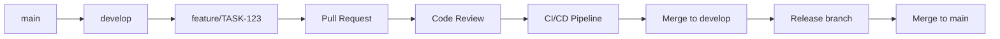

# 🔐 GitHub Enterprise Workflow Rules

## 🎯 Objetivo
Regras obrigatórias para ambientes corporativos GitHub Enterprise, garantindo segurança, rastreabilidade e qualidade no versionamento.

## 🚨 REGRAS CRÍTICAS - NUNCA VIOLAR

### **❌ PROIBIÇÕES ABSOLUTAS**
- **JAMAIS fazer commit direto na `main/master`**
- **JAMAIS fazer push --force em branches compartilhadas**
- **JAMAIS commitar credenciais, tokens ou senhas**
- **JAMAIS fazer merge sem Pull Request aprovado**
- **JAMAIS bypassar branch protection rules**

## 🔄 Enterprise Git Flow Obrigatório

### **📋 Workflow Padrão**


### **🌿 Branch Naming Convention**
```bash
# Features
feature/JIRA-123-user-authentication
feature/TASK-456-payment-gateway

# Hotfixes  
hotfix/URGENT-789-security-patch
hotfix/PROD-101-memory-leak

# Releases
release/v1.2.0
release/v2.0.0-beta

# NUNCA usar
fix-bug        # ❌ Muito genérico
temp-branch    # ❌ Não rastreável  
test          # ❌ Sem contexto
```

## 🔐 Branch Protection Rules

### **🛡️ Main/Master Branch**
```yaml
# .github/branch-protection.yml
main:
  protection:
    required_reviews: 2
    dismiss_stale_reviews: true
    require_code_owner_reviews: true
    required_status_checks:
      - "ci/tests"
      - "ci/security-scan"
      - "ci/code-quality"
    restrictions:
      push: []  # Ninguém pode push direto
      merge: ["team-leads", "senior-devs"]
```

### **🔧 Develop Branch**
```yaml
develop:
  protection:
    required_reviews: 1
    required_status_checks:
      - "ci/tests"
      - "ci/lint"
    allow_force_pushes: false
    allow_deletions: false
```

## 📝 Pull Request Requirements

### **✅ PR Checklist Template**
```markdown
## 📋 Pull Request Checklist

### **Obrigatório**
- [ ] Branch criada a partir de `develop`
- [ ] Título segue padrão: `[TASK-123] Implementa autenticação JWT`
- [ ] Descrição completa com contexto de negócio
- [ ] Todos os testes passando
- [ ] Code coverage mantido/melhorado
- [ ] Security scan sem vulnerabilidades
- [ ] Performance impact analisado

### **Documentação**
- [ ] README atualizado (se necessário)
- [ ] API docs atualizadas
- [ ] CHANGELOG.md atualizado
- [ ] Migration scripts documentados

### **Reviews**
- [ ] Code review de senior developer
- [ ] Security review (para mudanças sensíveis)
- [ ] Architecture review (para mudanças estruturais)
- [ ] QA approval (para features customer-facing)
```

### **🎯 PR Title Standards**
```bash
# ✅ Correto
[JIRA-123] Implementa autenticação OAuth2
[TASK-456] Corrige memory leak no cache Redis  
[HOTFIX] Resolve SQL injection em user service

# ❌ Incorreto
fix bug           # Muito genérico
update code       # Não informativo
changes          # Sem contexto
```

## 🤖 Automated Workflows

### **🔧 Required CI/CD Checks**
```yaml
# .github/workflows/enterprise-checks.yml
name: Enterprise Quality Gates
on:
  pull_request:
    branches: [main, develop]

jobs:
  security-scan:
    runs-on: ubuntu-latest
    steps:
      - uses: actions/checkout@v3
      - name: Secret Scan
        uses: trufflesecurity/trufflehog@main
      - name: Dependency Check
        run: |
          npm audit --audit-level=high
          # Fail se vulnerabilidades HIGH/CRITICAL
      - name: SAST Scan
        uses: github/codeql-action/analyze@v2

  code-quality:
    runs-on: ubuntu-latest  
    steps:
      - name: SonarQube Analysis
        uses: sonarqube-quality-gate-action@master
        with:
          scanMetadataReportFile: target/sonar/report-task.txt
      - name: Quality Gate
        run: |
          # Fail se quality gate não passou
          
  compliance:
    runs-on: ubuntu-latest
    steps:
      - name: License Check
        run: |
          # Verificar licenças de dependências
      - name: GDPR Compliance
        run: |
          # Scan por dados PII em código
```

## 🔍 Code Review Standards

### **👥 Review Assignment Matrix**
```yaml
# .github/CODEOWNERS
# Global owners
* @team-leads @architects

# Security-sensitive files  
/src/auth/ @security-team @senior-devs
/src/payments/ @security-team @senior-devs
/infrastructure/ @devops-team @architects

# Database changes
**/migrations/ @database-team @architects
**/schema/ @database-team

# Frontend
/frontend/ @frontend-team @ui-ux-team

# API changes
**/api/ @backend-team @api-team
```

### **📋 Review Criteria**
```markdown
## Code Review Checklist

### **🔐 Security Review**
- [ ] No hardcoded secrets/credentials
- [ ] Input validation presente
- [ ] SQL injection prevenido
- [ ] XSS protection implementado
- [ ] Authentication/authorization adequados
- [ ] Sensitive data não logada

### **🏗️ Architecture Review**  
- [ ] Design patterns seguidos
- [ ] SOLID principles aplicados
- [ ] Clean Architecture respeitada
- [ ] Dependencies injection usado
- [ ] Error handling robusto

### **⚡ Performance Review**
- [ ] Database queries otimizadas
- [ ] N+1 queries evitadas
- [ ] Caching apropriado
- [ ] Memory usage aceitável
- [ ] Response time dentro SLA
```

## 🚀 Release Management

### **📦 Semantic Versioning**
```bash
# Major (Breaking changes)
v2.0.0 - Nova arquitetura, API changes

# Minor (New features, backward compatible)  
v1.5.0 - Nova feature de pagamento

# Patch (Bug fixes)
v1.4.1 - Corrige memory leak
```

### **🏷️ Git Tagging Strategy**
```bash
# Release tags
git tag -a v1.2.0 -m "Release v1.2.0: Payment gateway integration"
git push origin v1.2.0

# Hotfix tags  
git tag -a v1.2.1-hotfix -m "Hotfix v1.2.1: Security patch"
git push origin v1.2.1-hotfix
```

## 🔐 Security & Compliance

### **🛡️ Commit Security**
```bash
# Pre-commit hooks obrigatórios
pre-commit install

# .pre-commit-config.yaml
repos:
  - repo: https://github.com/trufflesecurity/trufflehog
    hooks:
      - id: trufflehog
        name: TruffleHog
        description: Detect secrets in your data.
        
  - repo: https://github.com/Yelp/detect-secrets
    hooks:
      - id: detect-secrets
        args: ['--baseline', '.secrets.baseline']
```

### **📊 Audit Trail Requirements**
```markdown
## Commit Message Template
```
[TASK-123] Implementa autenticação JWT

### Business Context
- Requisito de segurança para acesso API
- Substitui autenticação básica legada
- Suporta refresh tokens

### Technical Details  
- JWT com RS256 algorithm
- Token expiry: 15 minutos
- Refresh token expiry: 7 dias
- Rate limiting: 5 tentativas/15min

### Testing
- Unit tests: 95% coverage
- Integration tests: OAuth flow completo
- Security tests: Token validation

### Deployment Notes
- Requires environment variables JWT_SECRET
- Database migration: add_refresh_tokens.sql
- Rollback plan: feature flag jwt_enabled=false

Co-authored-by: Jane Doe <jane@company.com>
```

## 🎯 Enterprise GitHub Settings

### **🔧 Repository Configuration**
```yaml
# Repository settings via GitHub API
repository:
  security:
    secret_scanning_enabled: true
    vulnerability_alerts_enabled: true
    automated_security_fixes: true
    
  settings:
    delete_branch_on_merge: true
    allow_merge_commit: false
    allow_rebase_merge: true
    allow_squash_merge: true
    
  branch_protection:
    main:
      required_pull_request_reviews: 2
      dismiss_stale_reviews: true
      require_code_owner_reviews: true
      required_status_checks: ["ci/tests", "ci/security"]
      enforce_admins: true
```

### **👤 Team Permissions**
```yaml
# GitHub Teams Configuration
teams:
  senior-developers:
    permissions: admin
    members: ["john.doe", "jane.smith"]
    
  developers:
    permissions: push
    branch_restrictions: ["!main", "!master"]
    
  contractors:
    permissions: pull
    require_reviews_from: ["senior-developers"]
```

## 🚨 Incident Response

### **🔥 Emergency Hotfix Process**
```bash
# 1. Create hotfix branch from main
git checkout main
git pull origin main
git checkout -b hotfix/URGENT-security-patch

# 2. Implement fix with minimal changes
# 3. Expedited review process (1 senior dev approval)
# 4. Deploy to staging first
# 5. Deploy to production after validation
# 6. Post-incident review mandatory
```

### **📋 Post-Incident Checklist**
- [ ] Root cause analysis completed
- [ ] Fix deployed and verified
- [ ] Monitoring alerts updated
- [ ] Documentation updated
- [ ] Team retrospective scheduled
- [ ] Process improvements identified

## 🎓 Training & Onboarding

### **📚 New Developer Checklist**
```markdown
## GitHub Enterprise Onboarding

### **Setup**
- [ ] GitHub Enterprise account created
- [ ] SSH keys configured
- [ ] 2FA enabled
- [ ] Teams assigned
- [ ] Repository access granted

### **Tools Setup**
- [ ] Git configured with company email
- [ ] Pre-commit hooks installed
- [ ] IDE plugins configured (SonarLint, etc)
- [ ] VPN access for private repos

### **Training Completed**
- [ ] Git flow training
- [ ] Code review guidelines
- [ ] Security best practices
- [ ] CI/CD pipeline overview
- [ ] Compliance requirements
```

## 📊 Metrics & Monitoring

### **🎯 KPIs to Track**
- Pull Request lead time < 24h
- Code review completion rate > 95%
- Security vulnerabilities = 0 in main
- Branch protection violations = 0
- Failed CI/CD builds < 5%
- Documentation coverage > 80%

### **🚨 Alerting Rules**
```yaml
alerts:
  - name: "Commit to Main Branch"
    condition: "direct push to main/master"
    severity: "critical"
    action: "immediate notification + rollback"
    
  - name: "Security Vulnerability"
    condition: "high/critical vulnerability detected"  
    severity: "high"
    action: "block deployment + security team notification"
    
  - name: "Failed Security Scan"
    condition: "secret detected in code"
    severity: "critical" 
    action: "block merge + immediate review"
```

## 🔧 Cascade/AI Assistant Rules

### **🤖 AI Assistant Constraints**
```markdown
## Regras para Assistentes AI (Cascade, Copilot, etc)

### **❌ NUNCA Permitir que AI:**
- Execute `git push` para main/master
- Faça commits com mensagens genéricas
- Ignore branch protection rules
- Commite secrets ou credentials
- Bypasse code review process

### **✅ AI DEVE Sempre:**
- Criar branches com naming convention correta
- Sugerir commit messages detalhadas
- Executar testes antes de sugerir push
- Verificar se há secrets no código
- Lembrar do PR checklist
- Sugerir reviewers apropriados
```

### **🎯 AI Prompt Templates**
```markdown
# Template para AI
"Implemente [FEATURE] seguindo:
- Criar branch: feature/TASK-[ID]-[description]
- Implementar código com error handling
- Adicionar testes (coverage >80%)
- Verificar security best practices
- Preparar commit message detalhada
- NÃO fazer push para main
- Sugerir reviewers para PR"
```

---

**🔐 Regra de Ouro**: Em ambiente enterprise, **SEGURANÇA > VELOCIDADE**. Toda mudança deve ser rastreável, revisada e aprovada.

**📌 Lembrete**: Esta regra é **obrigatória** para todos os projetos enterprise e deve ser seguida por desenvolvedores e assistentes AI.

**🔄 Versão**: 1.0  
**📅 Última atualização**: 2024-12-19  
**👨‍💻 Criado por**: Universal AI-Powered Development Rules System
