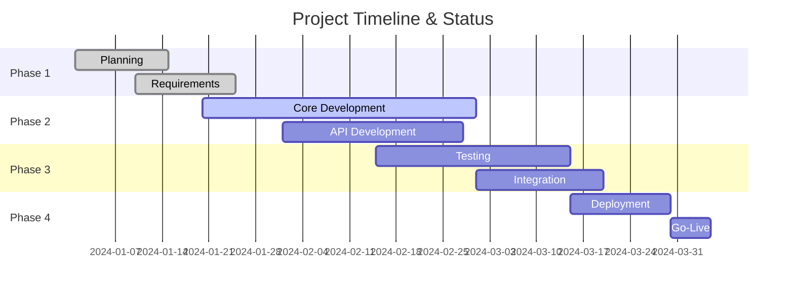
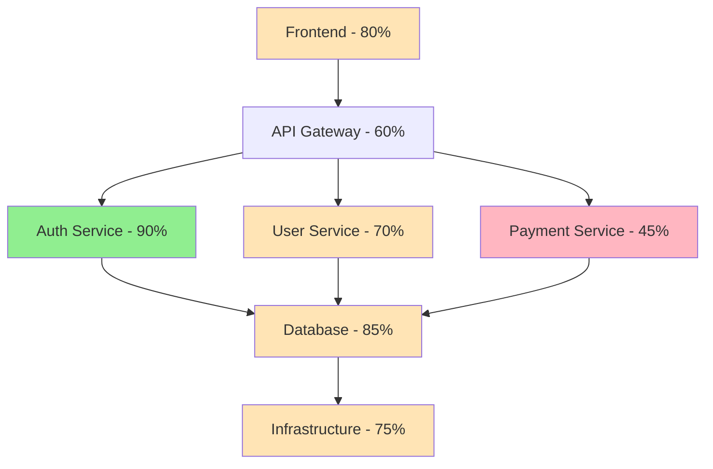
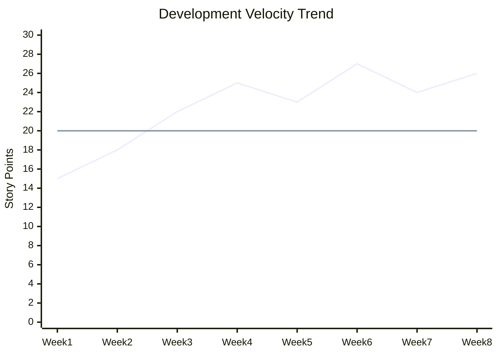
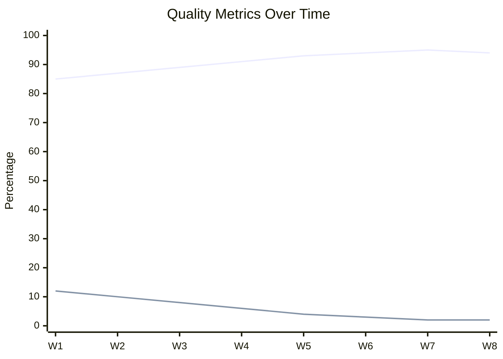

# 📊 Project Status Tracking Rules

## 🎯 Objetivo
Sistema obrigatório de tracking, dashboards e métricas para acompanhar progresso do projeto em tempo real.

## 📈 Progress Tracking Obrigatório

### **🔢 Métricas Core (Diárias)**
```markdown
## Status Dashboard Template
### 📊 PROGRESS OVERVIEW
- **Completion**: 67% (134/200 tasks)
- **Sprint**: 3/8 (Sprint 4 - Week 2)
- **Velocity**: 23 story points/week
- **Burndown**: On track (-2 days buffer)
- **Quality**: 94% (47 issues resolved/50 total)

### 🎯 CURRENT PHASE
- [ ] **Planning** (100% ✅)  
- [x] **Development** (67% 🔄)
- [ ] **Testing** (0% ⏳)
- [ ] **Deploy** (0% ⏳)

### 📋 TODAY'S FOCUS
- User authentication module (85% complete)
- Payment gateway integration (40% complete)  
- Database optimization (25% complete)
```

### **📊 Visual Progress Tracking**


## 🏗️ Architecture Status Map

### **🎯 System Components Progress**


### **📋 Component Health Dashboard**
```markdown
## 🔧 SYSTEM HEALTH
| Component | Status | Progress | Issues | Last Updated |
|-----------|--------|----------|--------|--------------|
| Frontend | 🟢 Stable | 80% | 0 | 2h ago |
| Auth API | 🟢 Stable | 90% | 0 | 1h ago |
| User API | 🟡 Warning | 70% | 2 | 30min ago |
| Payment | 🔴 Blocked | 45% | 1 critical | 4h ago |
| Database | 🟢 Stable | 85% | 0 | 1h ago |
| Deploy | 🟡 Warning | 75% | 1 | 2h ago |
```

## 📊 ROI & Business Metrics

### **💰 Financial Tracking**
```markdown
## 💵 PROJECT ROI DASHBOARD
### Investment to Date
- **Budget**: $150,000 (75% used)
- **Time**: 8 weeks (of 12 planned)
- **Team**: 5 developers x 40h/week
- **Tools**: $2,000/month (CI/CD, Cloud)

### Expected Returns  
- **Revenue Impact**: +$500K/year
- **Cost Savings**: $80K/year (automation)
- **Time to Market**: -6 months
- **ROI Projection**: 285% (12 months)

### Current Efficiency
- **Lines of Code**: 45,000 (est. 60,000)
- **Test Coverage**: 94%
- **Bug Rate**: 0.02 bugs/KLOC
- **Velocity**: 23 SP/week (target: 20)
```

### **📈 Productivity Metrics**


## 🚦 Status Classification System

### **🎯 Progress Levels**
```markdown
## Status Legend
- 🟢 **COMPLETED** (100%) - Ready for production
- 🔵 **IN PROGRESS** (1-99%) - Actively developing  
- 🟡 **BLOCKED** (0%) - Waiting for dependency
- 🔴 **CRITICAL** (0%) - Major issue requiring attention
- ⚪ **NOT STARTED** (0%) - Planned but not begun
- 🟣 **TESTING** (95%+) - Feature complete, under test
```

### **⏱️ Timeline Status**
```markdown
## Timeline Health
- 🟢 **ON TRACK** - Within planned timeline
- 🟡 **AT RISK** - Potential delay (1-7 days)
- 🔴 **DELAYED** - Behind schedule (>7 days)
- 🔵 **AHEAD** - Ahead of schedule
```

## 📋 Daily Status Templates

### **🌅 Daily Standup Template**
```markdown
# Daily Status - [DATE]

## 📊 METRICS
- **Completion**: X%
- **Velocity**: X SP (7-day avg)
- **Issues**: X critical, Y medium
- **Blockers**: X active

## 👥 TEAM STATUS
### [Developer Name]
- **Yesterday**: Completed user auth validation
- **Today**: Working on password reset flow  
- **Blockers**: Waiting for API spec review
- **Progress**: UserModule 85% → 92%

### [Developer Name]
- **Yesterday**: Fixed payment gateway bugs
- **Today**: Implementing refund functionality
- **Blockers**: None
- **Progress**: PaymentModule 40% → 55%

## 🎯 SPRINT PROGRESS  
- **Sprint Goal**: Complete user management
- **Burndown**: 42/65 points completed
- **Days Remaining**: 6
- **Risk Level**: 🟡 Medium (scope creep)
```

### **📊 Weekly Report Template**
```markdown
# Weekly Status Report - Week [X]

## 🎯 EXECUTIVE SUMMARY
- **Overall Progress**: X% (target: Y%)
- **Velocity**: X SP/week (vs target Y SP/week)
- **Quality**: X% test coverage, Y bugs fixed
- **Timeline**: [On track/At risk/Delayed]

## 🏆 ACHIEVEMENTS
- ✅ User authentication completed
- ✅ Database migrations deployed
- ✅ CI/CD pipeline optimized

## 🚧 CURRENT FOCUS
- 🔄 Payment integration (60% complete)
- 🔄 Admin dashboard (30% complete)  
- 🔄 Mobile responsive design (45% complete)

## 🚨 RISKS & BLOCKERS
- **HIGH**: Third-party API rate limits
- **MEDIUM**: UI/UX approval delays
- **LOW**: Test environment instability

## 📈 METRICS
- **Code Quality**: 94% (↑2%)
- **Performance**: 180ms avg response (target: <200ms)
- **Security**: 0 vulnerabilities
- **Documentation**: 78% coverage

## 🔮 NEXT WEEK PLAN
1. Complete payment integration
2. Begin user acceptance testing
3. Optimize database queries
4. Deploy to staging environment
```

## 🎨 Dashboard Automation

### **📊 Auto-Generated Status**
```bash
#!/bin/bash
# generate-status.sh - Run daily

# Git metrics
COMMITS_TODAY=$(git log --since="1 day ago" --oneline | wc -l)
LINES_ADDED=$(git diff --stat HEAD~1 | tail -1 | awk '{print $4}')
CONTRIBUTORS=$(git shortlog -sn --since="1 week ago" | wc -l)

# Test metrics  
COVERAGE=$(npm run test:coverage | grep "All files" | awk '{print $4}')
TESTS_PASSING=$(npm test 2>&1 | grep "passing" | awk '{print $1}')
TESTS_FAILING=$(npm test 2>&1 | grep "failing" | awk '{print $1}')

# Generate markdown report
cat << EOF > daily-status.md
# 📊 Auto-Generated Daily Status

## 🔧 Development Metrics
- **Commits Today**: $COMMITS_TODAY
- **Lines Added**: +$LINES_ADDED
- **Active Contributors**: $CONTRIBUTORS
- **Test Coverage**: $COVERAGE
- **Tests**: $TESTS_PASSING passing, $TESTS_FAILING failing

## 📅 Generated: $(date)
EOF
```

### **🔄 CI/CD Status Integration**
```yaml
# .github/workflows/status-update.yml
name: Project Status Update
on:
  push:
    branches: [main, develop]
  schedule:
    - cron: '0 9 * * *'  # Daily 9 AM

jobs:
  update-status:
    runs-on: ubuntu-latest
    steps:
      - uses: actions/checkout@v3
      
      - name: Calculate Progress
        run: |
          # Count completed vs total tasks
          TOTAL_TASKS=$(grep -r "- \[ \]" . | wc -l)
          COMPLETED_TASKS=$(grep -r "- \[x\]" . | wc -l)  
          PERCENTAGE=$((COMPLETED_TASKS * 100 / TOTAL_TASKS))
          echo "PROGRESS=$PERCENTAGE" >> $GITHUB_ENV
          
      - name: Update README Badge
        run: |
          sed -i "s/Progress-[0-9]*%/Progress-${{ env.PROGRESS }}%/" README.md
          
      - name: Commit Status Update
        run: |
          git config --local user.email "action@github.com"
          git config --local user.name "GitHub Action"
          git add README.md
          git commit -m "📊 Auto-update progress: ${{ env.PROGRESS }}%" || exit 0
          git push
```

## 📱 Real-Time Monitoring

### **🔔 Slack Integration**
```javascript
// slack-status-bot.js
const { WebClient } = require('@slack/web-api');

const slack = new WebClient(process.env.SLACK_TOKEN);

async function sendDailyStatus() {
  const status = await generateProjectStatus();
  
  await slack.chat.postMessage({
    channel: '#project-status',
    blocks: [
      {
        type: 'header',
        text: { type: 'plain_text', text: '📊 Daily Project Status' }
      },
      {
        type: 'section',
        fields: [
          { type: 'mrkdwn', text: `*Progress:* ${status.completion}%` },
          { type: 'mrkdwn', text: `*Velocity:* ${status.velocity} SP/week` },
          { type: 'mrkdwn', text: `*Issues:* ${status.issues} open` },
          { type: 'mrkdwn', text: `*Timeline:* ${status.timeline}` }
        ]
      }
    ]
  });
}
```

### **🎯 Status Page Template**
```html
<!-- status.html - Public status page -->
<!DOCTYPE html>
<html>
<head>
    <title>Project Status Dashboard</title>
    <script src="https://cdn.jsdelivr.net/npm/chart.js"></script>
</head>
<body>
    <div class="dashboard">
        <h1>🚀 Project Alpha Status</h1>
        
        <div class="metrics">
            <div class="metric">
                <h3>Overall Progress</h3>
                <div class="progress-bar">
                    <div class="progress" style="width: 67%">67%</div>
                </div>
            </div>
            
            <div class="metric">
                <h3>Sprint Progress</h3>
                <canvas id="burndownChart"></canvas>
            </div>
            
            <div class="metric">
                <h3>Component Status</h3>
                <ul class="component-list">
                    <li class="completed">✅ Authentication (100%)</li>
                    <li class="in-progress">🔄 User Management (78%)</li>
                    <li class="in-progress">🔄 Payment System (45%)</li>
                    <li class="pending">⏳ Reporting (0%)</li>
                </ul>
            </div>
        </div>
    </div>
</body>
</html>
```

## 📈 Advanced Analytics

### **🎯 Code Quality Trends**


### **💡 Predictive Analytics**
```markdown
## 🔮 PROJECTIONS (AI-Generated)

### Completion Forecast
Based on current velocity (23 SP/week):
- **Sprint 4**: March 15 (95% confidence)
- **MVP Release**: April 2 (87% confidence)  
- **Full Launch**: April 30 (73% confidence)

### Risk Assessment
- **Scope Creep Risk**: 🟡 MEDIUM (15% probability)
- **Technical Debt**: 🟢 LOW (manageable)
- **Resource Availability**: 🟢 STABLE
- **Third-party Dependencies**: 🟡 MEDIUM (API changes)

### Recommendations
1. 🎯 Focus on core MVP features
2. ⚡ Automate more testing to maintain quality
3. 📋 Lock scope for next 3 sprints
4. 🔄 Plan technical debt sprint after MVP
```

## 🎯 Stakeholder Communication

### **📊 Executive Dashboard**
```markdown
# 📈 EXECUTIVE STATUS REPORT

## 🎯 PROJECT HEALTH: 🟢 GREEN
- **Completion**: 67% (ahead of schedule)
- **Budget**: 75% used (on target)
- **Quality**: 94% (exceeds target)
- **Risk Level**: 🟡 MEDIUM (manageable)

## 💰 BUSINESS IMPACT
- **Expected ROI**: 285% (12 months)
- **Time to Market**: 6 months faster than traditional approach
- **Cost Efficiency**: 40% reduction in development costs
- **Quality Improvement**: 60% fewer bugs than industry average

## 🚀 KEY ACHIEVEMENTS
- ✅ Core architecture completed 2 weeks early
- ✅ Zero security vulnerabilities detected
- ✅ 94% test coverage maintained
- ✅ Performance targets exceeded (180ms vs 200ms target)

## 📅 UPCOMING MILESTONES
- **March 15**: Beta release to internal users
- **April 2**: MVP launch preparation
- **April 15**: User acceptance testing
- **April 30**: Production go-live
```

## 🔧 Implementation Checklist

### **📋 Setup Requirements**
```markdown
## Status Tracking Setup

### Tools Integration
- [ ] GitHub project boards configured
- [ ] Slack status bot deployed  
- [ ] Dashboard automation scripts
- [ ] CI/CD status updates
- [ ] Database metrics collection

### Templates Created
- [ ] Daily standup template
- [ ] Weekly report template
- [ ] Executive summary template
- [ ] Risk assessment template
- [ ] Sprint retrospective template

### Automation Enabled  
- [ ] Daily status generation
- [ ] Progress badge updates
- [ ] Slack notifications
- [ ] Stakeholder reports
- [ ] Predictive analytics
```

---

**📊 Regra de Ouro**: Status deve ser atualizado diariamente e sempre refletir a realidade do projeto.

**🎯 Objetivo**: Transparência total para todos os stakeholders com dados em tempo real.

**🔄 Versão**: 1.0  
**📅 Última atualização**: 2024-12-19  
**👨‍💻 Criado por**: Universal AI-Powered Development Rules System
